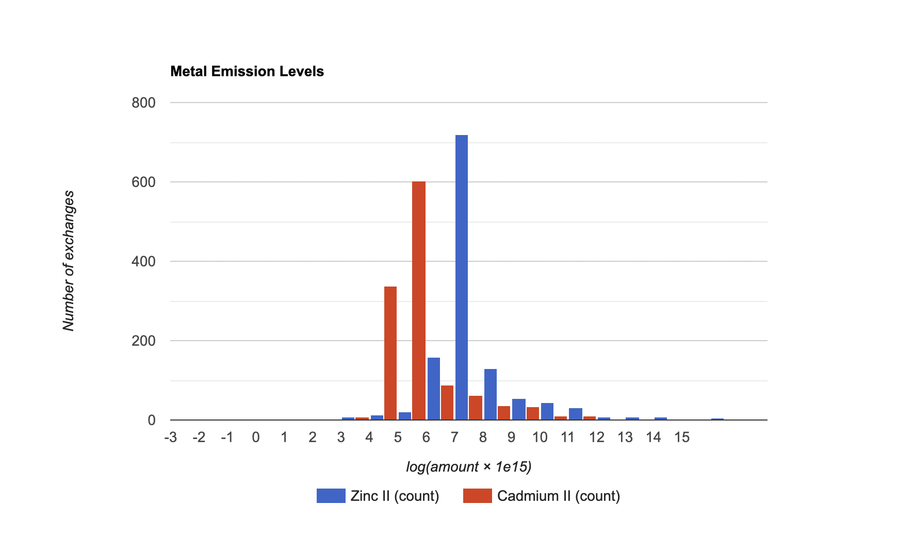

# Display a diagram with HTML

> **_NOTE:_** This script must be run in an open BAFU database — a free, populated database available on [Nexus](https://nexus.openlca.org/downloads). See [Set up a database](../set_up_a_database.md).

The following example shows how to display data in a diagram using HTML. In the example, all output
amounts of `Emission to air/low population density/Zinc II` and
`Emission to air/low population density/Cadmium II`
are collected from a database, transformed with `f(x) = log10(x * 1e15)` to make a nice
distribution, and shown in a histogram using the
[Google Chart API](https://developers.google.com/chart/interactive/docs/gallery/histogram). An HTML
page is generated that is loaded in a SWT `Browser` in a separate window.

```python
import json
import math

from org.eclipse.swt import SWT
from org.eclipse.swt.browser import Browser
from org.eclipse.swt.layout import FillLayout
from org.eclipse.swt.widgets import Display, Shell


def get_flow(name, category):  # type: (str, Category) -> Flow
    """
    Get the flow `category / name` from the database.
    """
    flows = FlowDao(db).getForName(name)

    for flow in flows:
        if flow.category == category:
            return flow

    raise Exception("Flow not found: %s" % name)


def get_results():  # type: () -> List[List[float or str]]
    """
    Get the values for the flow from the process inputs and outputs and
    transform them: f(x) = log10(x * 1e15).
    """
    results = []

    category = CategoryDao.sync(
        db, ModelType.FLOW, "Elementary flows", "Emission to air", "low population density"
    )

    zinc = get_flow("Zinc II", category)
    results.append(collect_amounts(zinc))

    cadmium = get_flow("Cadmium II", category)
    results.append(collect_amounts(cadmium))

    return [list(row) for row in zip(*results)]


def collect_amounts(flow):  # type: (Flow) -> List[float or str]
    results = [flow.name]

    def collect_results(record):
        results.append(math.log10(record.getDouble(1) * 1e15))
        return True

    print("Collecting results for %s" % flow.name)
    query = (
        "SELECT resulting_amount_value FROM tbl_exchanges WHERE f_flow = %i AND is_input = 0"
        % flow.id
    )
    NativeSql.on(db).query(query, collect_results)

    print("%d results collected" % (len(results) - 1))

    return results


def make_html(results):  # type: (List[List[float or str]]) -> str
    """Generate the HTML page for the data."""

    html = """<html>
    <head>
        <script type="text/javascript" src="https://www.gstatic.com/charts/loader.js"></script>
        <script type="text/javascript">
        google.charts.load("current", {packages:["corechart"]});
        google.charts.setOnLoadCallback(drawChart);
        function drawChart() {
            var data = google.visualization.arrayToDataTable(%s);

            var options = {
                title: 'Metal Emission Levels',
                legend: { position: 'bottom' },
                hAxis: {
                    title: 'log(amount × 1e15)',
                    ticks: [%s]
                },
                vAxis: {
                    title: 'Number of exchanges'
                }
            };

            var chart = new google.visualization.Histogram(
                document.getElementById('chart_div')
            );
            chart.draw(data, options);
        }
        </script>
    </head>
    <body>
        <div id="chart_div" style="width: 900px; height: 500px;"></div>
    </body>
    </html>
    """ % (
        json.dumps(results),
        ", ".join(str(x) for x in range(-3, 16)),
    )
    return html


def main():
    """
    Create the results, HTML, and window with the Browser and set the HTML
    content of the Browser.
    """
    results = get_results()
    html = make_html(results)

    shell = Shell(Display.getDefault())
    shell.setText("Metal Emissions")
    shell.setLayout(FillLayout())
    browser = Browser(shell, SWT.NONE)
    browser.setText(html)

    shell.open()


App.runInUI("Visualizing Metal Emission Levels", main)
```

To see the result, copy and paste the code above in the openLCA Python console in an opened
BAFU database.

The result looks like this:


