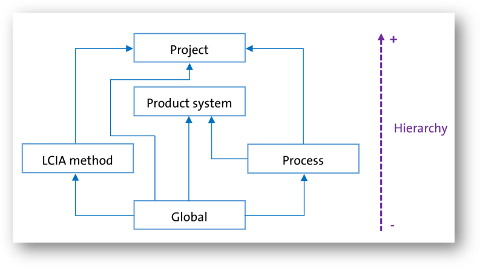

# Parametrize input exchanges

Parameters in openLCA live at different scopes — most commonly the global level and the process level.
If the same parameter has different values at different levels, the system's hierarchy determines which
parameter value takes precedence in calculations. The parameter values at the highest hierarchy (+)
overwrite the value at the lower level (-). For example, if a process has the same name as a global
parameter 'x', then within that process, the parameter will have the process parameter value. While in
another process if 'x' is used, it will have the value of the global parameter.



_Hierarchy of parameters in openLCA_

_Source: [openLCA 2 manual — Parameter hierarchy](https://greendelta.github.io/openLCA2-manual/parameters/hierarchy.html)_

## Global parameters

In this first example, we parametrize the input exchange of a process with a global parameter.

```python
# get the mass and volume flow properties from the database
number = db.getForName(FlowProperty, "Number")
mass = db.getForName(FlowProperty, "Mass")

# create an output product for the process
coffee_cup = Flow.product("Cup of coffee", number)
# create a process with the "Cup of coffee" as quantitative reference
coffee_brewing = Process.of("Coffee brewing", coffee_cup)

# create the input product flows: coffee
coffee = Flow.product("Coffee", mass)

# create the coffee exchange with a formula using a global parameter
coffee_input = Exchange.of(coffee)
# creating a global parameter for the coffee intensity
intensity = Parameter.global("intensity", 1.0)
intensity.description = "The intensity of the coffee brewing process (0-10)"
coffee_input.formula = "0.01 * " + intensity.name
# set the exchange default amount
coffee_input.amount = 0.01 * intensity.value
coffee_input.isInput = True
# add the exchange to the process
coffee_brewing.add(coffee_input)

# insert the process and the newly created flows into the database
db.insert(
    coffee_cup,
    coffee,
    intensity,
    coffee_brewing,
)

# refresh the navigator to see the new process
App.runInUI("Refresh navigator", lambda: Navigator.refresh())
```

## Process parameters

In the next example, we parametrize the input exchange of a process with a process parameter.

```python
# get the mass and volume flow properties from the database
number = db.getForName(FlowProperty, "Number")
mass = db.getForName(FlowProperty, "Mass")
volume = db.getForName(FlowProperty, "Volume")

# create an output product for the process
tea_cup = Flow.product("Cup of tea", number)
# create a process with the "Cup of tea" as quantitative reference
tea_brewing = Process.of("Tea brewing", tea_cup)
water = Flow.elementary("Water", volume)
tea_brewing.input(water, 0.0001)
tea = Flow.product("Tea", mass)
tea_brewing.input(tea, 0.01)

# create a milk exchange with a formula using a process parameter
milk = Flow.product("Milk", mass)
milk_input = Exchange.of(milk)
# creating a process parameter for the milk amount
with_milk = Parameter.process("with_milk", 0)
with_milk.description = "A boolean parameter to indicate if milk is added"
milk_input.formula = "0.005 * " + with_milk.name
# set the exchange default amount
milk_input.amount = 0.005 * with_milk.value
milk_input.isInput = True
# add the exchange to the process
tea_brewing.add(milk_input)
tea_brewing.parameters.add(with_milk)

# insert the process and the newly created flows into the database
# note that the with_milk parameter is not inserted as it is added to the
# milk_production process
db.insert(
    tea_cup,
    water,
    tea,
    milk,
    tea_brewing
)

# refresh the navigator to see the new process
App.runInUI("Refresh navigator", lambda: Navigator.refresh())
```
