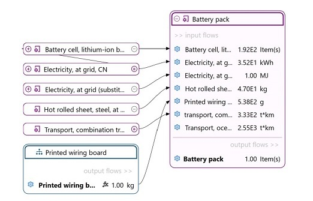

# Product system

Product systems are life cycle models and are used to calculate inventory results and impact
assessment.

A "product system" is described by ISO 14040 as a "collection of unit processes with elementary and
product flows, performing one or more defined functions, and which models the life cycle of a
product." In openLCA a product system is a set of processes connected by flows, performing one or more
defined functions and modelling the life cycle of a product. A product system has a reference process
with a defined amount of the product (referred to the functional unit), which serves as basis for
calculating impacts for all connected processes within the system.

_Source: [openLCA 2 manual — Product Systems](https://greendelta.github.io/openLCA2-manual/prod_sys/index.html)_

- [Create from a process](create.md)
- [Get from the database](from_database.md)
- [Update with more info](update.md)
- [Add a parameter redefinition set](add_parameter_redefinition_set.md)
- [Move to a category](to_category.md)
- [Delete a product system](delete.md)

## Types of product systems

A [process](../process/README.md) describes a single activity through its inputs and outputs around a
quantitative reference. A product system goes one step further: it links many processes through their
flows, starting from a reference process, so results can be calculated across the whole supply chain.

Product systems differ mainly in how they are built:

- **Linked to unit or system processes** — where no provider is set, the supply chain connects either
  to [unit processes or to system processes](../process/README.md) (fully detailed steps versus an
  aggregated result saved as a process).
- **Nested** — a product system can itself serve as the provider for another, giving a "nested"
  product system whose sub-results show up in the overall analysis.

_Example of a nested product system: the "Printed wiring board" product system feeds the "Battery
pack" as a provider._

These are advanced topics; for the details see the openLCA 2 manual's
[advanced product systems features](https://greendelta.github.io/openLCA2-manual/prod_sys/nested.html).
