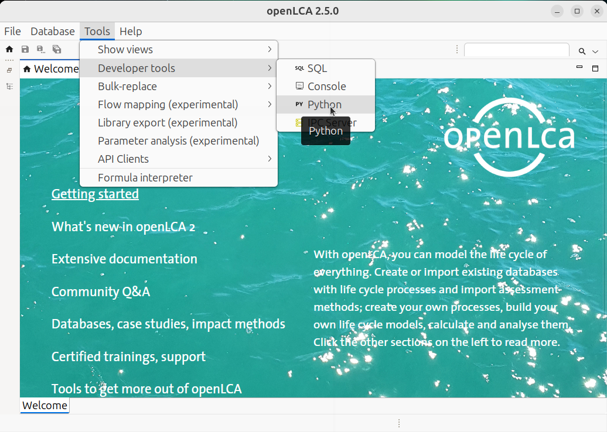
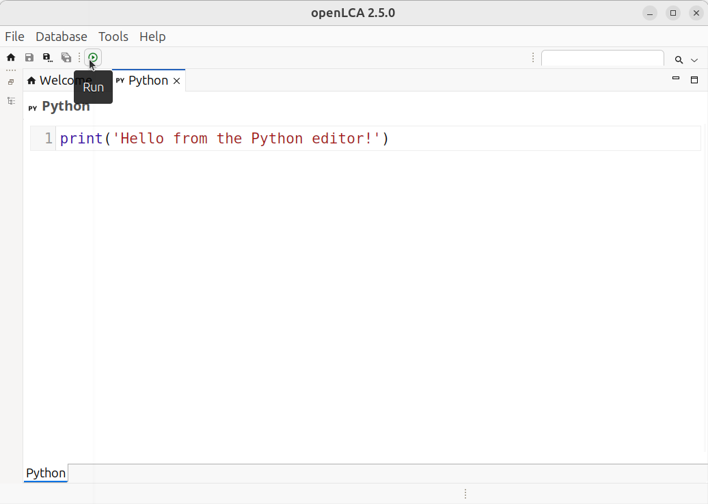
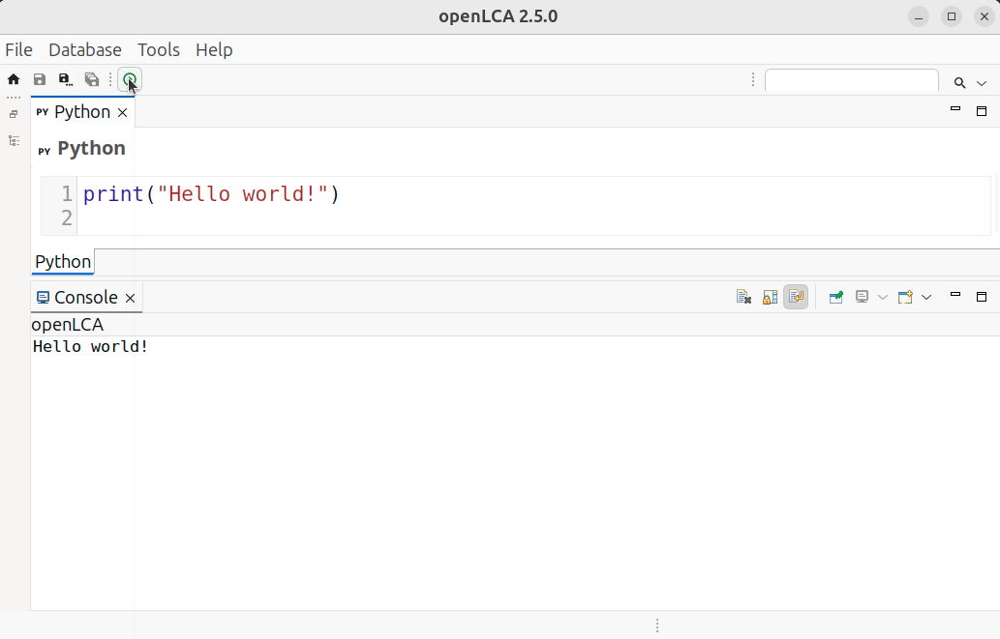

# Quickstart

This page covers writing and running your first script.

## Open the script editor

In openLCA, go to `Tools → Developer Tools → Python`. This opens the editor used to write and run
scripts.





## Run your first script

Enter the following in the editor and click **Run** (the ▶ button in the toolbar):

```python
print("Hello world!")
```

The openLCA console displays:

```
Hello world!
```



This is the basic cycle: write a script, run it, and read the output in the console.

## Read from your database

This script reads from your database, so openLCA must be open with a database loaded. If you do not have
one yet, see [Set up a database](set_up_a_database.md) first.

```python
# Remember to run this with a database open
flows = db.getAll(Flow)
print("Your database contains %d flows." % len(flows))
```

Two details are worth noting. `db` refers to the open database and is always available; you do not need
to set it up. And `Flow` is used without an `import`: openLCA makes its data model available
automatically. Both are explained in [Technical details](how_scripts_run.md).

## Where to go next

- [Set up a database](set_up_a_database.md) — if you do not have one ready
- [A minimal example](minimal_example.md) — a complete model and calculation from start to finish
- A specific task: flows, processes, product systems, calculation, or Excel
